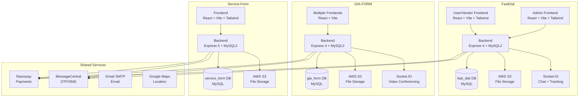

# Flutter Flirt Project — Complete Audit & Deliverables

> **Generated**: 2026-06-09 | **Repositories**: 3 | **Endpoints**: ~150+ | **Database Tables**: ~70+

---

# DELIVERABLE 1 — ARCHITECTURE REPORT

## Executive Summary

The Flutter Flirt project is a **multi-product SaaS platform** comprising three independent but architecturally similar applications:

| Product | Domain | Purpose |
|---|---|---|
| **FastDial** | Service Marketplace | Connects customers with service vendors (plumbing, electricians, etc.), supports real-time chat, location tracking, bookings, subscriptions, and Razorpay payments |
| **GIA-FORM** | Legal/Government Forms + School LMS | Processes legal documents (GST registration, property registration, affidavits, etc.) with vendor assignment. Also includes a full school LMS (GIA School) with courses, videos, Q&A |
| **Service-Form** | Dynamic Form Platform | Dynamic form builder with vendor assignment workflows, auto-expiry cascading, and integrated payments |

## Architecture Overview



## Tech Stack (All Repos)

| Layer | Technology | Version |
|---|---|---|
| **Runtime** | Node.js | 18+ |
| **Backend Framework** | Express.js | 4.x (FastDial, GIA), 5.x (Service-Form) |
| **Database** | MySQL | 8.x via mysql2 |
| **Frontend** | React + Vite | React 18/19 |
| **CSS** | TailwindCSS | 3.x / 4.x |
| **Auth** | JWT (jsonwebtoken) | Bearer token |
| **Passwords** | bcrypt / bcryptjs | Salted hashing |
| **File Upload** | multer + AWS S3 | Memory storage → S3 |
| **Payments** | Razorpay | INR currency |
| **OTP** | MessageCentral | SMS verification |
| **Real-time** | Socket.IO | 4.x |
| **Email** | Nodemailer + Gmail SMTP | — |

---

# DELIVERABLE 2 — FOLDER ANALYSIS

## FastDial-Backend

```
FastDial-Backend-main/backend/
├── app.js                     # Express app setup, routes, Socket.IO init
├── server.js                  # Server entry, dotenv, error handlers
├── socket.js                  # Socket handler 2 (vendor-customer-admin chat)
├── package.json               # Dependencies
├── .env                       # Environment variables
├── Dockerfile                 # Docker build
├── buildspec.yml              # AWS CodeBuild spec
├── controllers/
│   ├── admin/
│   │   ├── authController.js      # Admin signup, login, OTP, JWT protect
│   │   └── admindataController.js # Admin CRUD (services, categories, vendors, subscriptions)
│   ├── cutomers/ (typo: customers)
│   │   ├── authController.js      # Customer OTP-based signup/login
│   │   └── customersdataController.js  # Customer bookings, payments, reviews, addresses, tracking
│   ├── customers/
│   │   └── customersdataController.js  # Duplicate folder (only getSLIDER_IMAGES used)
│   ├── vendors/
│   │   ├── authController.js      # Vendor signup, login, OTP, JWT protect
│   │   └── vendordataController.js # Vendor bookings, subscriptions, payments, services
│   ├── chatController.js          # Chat room creation, message save/fetch
│   └── errorController.js         # Global error handler
├── database/
│   ├── db.js                      # MySQL2 connection pool
│   ├── dbquerieshandlers.js       # Generic GET data handler
│   └── sqlStatementGenarator.js   # Generic INSERT/UPDATE generator
├── middlewares/
│   ├── s3bucket.js                # AWS S3 upload/delete
│   ├── fast2sms.js                # MessageCentral OTP send/verify
│   └── blockunsubscribe.js        # Subscription check middleware
├── models/
│   ├── chatMessage.js             # Chat message model (admin-vendor)
│   └── chatRoom.js                # Chat room model (admin-vendor)
├── router/
│   ├── adminRouter.js             # Admin routes (~30 endpoints)
│   ├── vendorsRouter.js           # Vendor routes (~40 endpoints)
│   ├── customersRouter.js         # Customer routes (~50 endpoints)
│   ├── chatRoutes.js              # Chat REST routes
│   ├── adminvendorRouter.js       # Admin-vendor chat routes
│   ├── handelRouter.js            # Global routes
│   └── slider_image.js            # Slider image routes
├── socket/
│   ├── socketHandler.js           # Socket handler 1 (admin-vendor chat)
│   └── socketServer.js            # Socket handler 3 (location tracking)
├── utils/
│   ├── appError.js                # Custom error class
│   ├── catchAsyncError.js         # Async error wrapper
│   └── sendMail.js                # Nodemailer email sender
└── test/                          # Test directory (empty)
```

## GIA-FORM Backend

```
GIA-FORM-main/Backend/
├── app.js                     # Express + Socket.IO (video conferencing)
├── server.js                  # Server entry
├── .env                       # Environment
├── controllers/
│   ├── admin/                 # Admin form management
│   ├── class-admins/          # School LMS admin controllers
│   ├── class-users/           # School LMS user controllers
│   ├── usrers/ (typo)         # User controllers
│   ├── vendors/               # Vendor controllers
│   └── errorController.js
├── database/
│   ├── db.js                  # MySQL2 pool
│   ├── dbBackup.sql           # Full DB schema (1121 lines, has errors)
│   ├── dbquerieshandlers.js   # Generic GET
│   ├── dbquerieshandlers copy.js  # Duplicate file
│   └── sqlStatementGenarator.js
├── middlewares/
│   ├── s3bucket.js            # AWS S3
│   ├── fast2sms.js            # OTP
│   └── payment.js             # Razorpay order creation
├── router/
│   ├── adminRouter.js
│   ├── userrouter.js
│   ├── vendorRouter.js
│   ├── handlerRouter.js
│   ├── classAdminRouter.js
│   └── classUsersRouter.js
└── utils/
    ├── appError.js
    └── catchAsyncError.js
```

## Service-Form

```
Service-Form-main/
├── backend/
│   ├── app.js                 # Express 5 app
│   ├── server.js              # Server entry
│   ├── .env                   # Environment
│   ├── generateSignature.js   # Razorpay signature test (SECURITY RISK)
│   ├── controllers/
│   │   ├── super_admin/       # Super admin auth + CRUD
│   │   ├── user/              # User auth + form responses + payments
│   │   └── vendor/            # Vendor auth + form response status
│   ├── database/
│   │   ├── db.js              # MySQL2 pool
│   │   ├── dbschema.sql       # Full schema (230 lines)
│   │   ├── dbquerieshandlers.js
│   │   └── sqlStatementGenarator.js
│   ├── middleware/
│   │   ├── authMiddleware.js  # JWT verify
│   │   ├── fast2sms.js        # OTP
│   │   └── s3bucket.js        # AWS S3
│   ├── routers/
│   │   ├── super_adminRouter.js
│   │   ├── userRouter.js
│   │   ├── vendorRouter.js
│   │   └── handleRouter.js
│   └── utils/
│       ├── appError.js
│       ├── catchAsyncError.js
│       └── sendEmail.js
├── Service_form_frontend/     # React + Vite + TailwindCSS 4
├── docker-compose.yml         # Docker compose (frontend + backend + nginx)
├── nginx.conf                 # Reverse proxy config
├── dockerfile                 # Frontend Docker build
```

---

# DELIVERABLE 3 — FILE ANALYSIS (Key Files)

> For brevity, covering the most important files per repository. Every file in the folder analysis above was reviewed.

## FastDial Key Files

### app.js
- **Purpose**: Express app setup, routes, Socket.IO initialization
- **Imports**: express, http, socket.io, cors, helmet, all routers, all socket handlers
- **Exports**: HTTP server
- **Issues**: CORS hardcoded to production domains; helmet imported but not used; 3 socket handlers attached (potential conflicts)

### dbquerieshandlers.js
- **Purpose**: Generic data fetcher — builds SELECT * from any table/view with query param filters
- **CRITICAL SECURITY**: Column names from `req.query` are inserted directly into SQL with only backtick escaping — vulnerable to SQL injection
- **Used by**: Nearly every GET endpoint across the app

### sqlStatementGenarator.js
- **Purpose**: Generic INSERT/UPDATE statement builder from req.body
- **CRITICAL SECURITY**: Column names from `req.body` keys directly interpolated into SQL
- **Used by**: Nearly every POST/PUT endpoint

### customer authController.js
- **Purpose**: Customer signup (OTP-only, no password), login (OTP verify)
- **Note**: Hardcoded test credentials — mobile `9999988888` with OTP `1234` bypasses verification
- **Auth**: JWT with { mobile, customer_id } payload

---

# DELIVERABLE 4 — BUG REPORT

## CRITICAL Severity

### BUG-001: SQL Injection in dbquerieshandlers.js (All 3 Repos)
- **File**: `database/dbquerieshandlers.js` (FastDial, GIA, Service-Form)
- **Root Cause**: User-controlled query parameter keys used as column names in WHERE clause
- **Fix**: Validate column names against an allowlist before use
- **Impact**: Full database read/write compromise

### BUG-002: SQL Injection in sqlStatementGenarator.js (All 3 Repos)
- **File**: `database/sqlStatementGenarator.js` (FastDial, GIA, Service-Form)
- **Root Cause**: `req.body` keys used as column names in INSERT/UPDATE statements
- **Fix**: Validate column names against table schema allowlist

### BUG-003: Hardcoded Razorpay Secret Key
- **File**: `generateSignature.js`
- **Line**: 5
- **Root Cause**: `key_secret = "OLviLXJzQ5bzy5z1b8IxJi0A"` hardcoded in source
- **Fix**: Remove file or move to .env. Rotate the key immediately

### BUG-004: GIA SQL Backup Syntax Errors (6 errors)
- **File**: `dbBackup.sql`
- **L348**: `topics` references `chapters` FOREIGN KEY but `chapters` is created AFTER `topics`
- **L694**: Missing comma: `fields JSON NOT NULL` missing comma before `form_name`
- **L695**: Semicolon inside CREATE TABLE: `ON DELETE CASCADE;` should not have semicolon
- **L925**: Semicolon before FOREIGN KEY: `REFERENCES topics(topic_id) ;` incorrect
- **L1000**: Missing semicolon after `DROP TABLE IF EXISTS payment_hsitory`
- **L1012-1023**: `subjects_purchased` has duplicate PRIMARY KEY definition

### BUG-005: Express 5 Incompatibility
- **File**: `Service-Form package.json`
- **Root Cause**: `express: "^5.1.0"` — Express 5 has breaking changes with error handling middleware, `req.params`, async routes
- **Fix**: Downgrade to Express 4.21.x for stability

## HIGH Severity

### BUG-006: ENV Variable Name Mismatch (FastDial Email)
- **File**: `sendMail.js`
- **Code uses**: `EMAIL_USER`, `EMAIL_PASS`, `EMAIL_SERVICE`, `EMAIL_FROM`
- **.env defines**: `SMTP_EMAIL`, `SMTP_PASS`
- **Fix**: Align env variable names

### BUG-007: Missing uuid Dependency (FastDial + Service-Form)
- **File**: package.json in both repos
- **Root Cause**: `s3bucket.js` uses `require("uuid")` but `uuid` not in dependencies
- **Fix**: `npm install uuid`

### BUG-008: CORS Blocks Localhost (FastDial)
- **File**: `app.js`
- **Root Cause**: `origin: ["https://quickserve.info", "https://fastdial.in"]` — no localhost
- **Fix**: Add localhost origins in development mode

### BUG-009: GIA Room Messages Not Initialized
- **File**: `GIA app.js`
- **Root Cause**: `room.messages.push(chatMessage)` but `messages` array never created on room object
- **Fix**: Add `messages: []` to room creation

### BUG-010: GIA `socket.connectedRooms` Wrong Property
- **File**: `GIA app.js`
- **Root Cause**: `socket.connectedRooms` should be `socket.rooms` (Socket.IO v4 API)
- **Fix**: Change to `socket.rooms`

### BUG-011: Vendor Service Row Access Bug
- **File**: `vendor authController.js`
- **Root Cause**: `serviceRow.service_id` — but `db()` returns array, should be `serviceRow[0]?.service_id`
- **Fix**: Access first element of result array

### BUG-012: chatRoom.js createChatRoom Destructuring Bug
- **File**: `chatRoom.js`
- **Root Cause**: `const [result] = await db(...)` — `db()` returns result directly, not `[result]`
- **Fix**: Change to `const result = await db(...)`

### BUG-013: chatController.js Parameter Mismatch
- **File**: `chatController.js`
- **Root Cause**: Function accepts `(vendor_id, customer_id)` but `socket.js` calls with 3 args `(vendor_id, customer_id, admin_id)`
- **Fix**: Add `admin_id` parameter support

### BUG-014: Razorpay ENV Mismatch (FastDial)
- **File**: customersdataController.js, vendordataController.js
- **Code uses**: `RAZORPAY_KEY_ID`, `RAZORPAY_KEY_SECRET`
- **.env defines**: `RAZORPAY_KEY_ID`, `RAZORPAY_SECRET`
- **Fix**: Align to `RAZORPAY_SECRET` in code or vice versa

### BUG-015: Service-Form Global Error Handler Disabled
- **File**: `Service-Form app.js`
- **Root Cause**: `// app.use(globalErrorHandler);` is commented out
- **Fix**: Uncomment and import the error handler

### BUG-016: Service-Form User Routes Unprotected
- **File**: `userRouter.js`
- **Root Cause**: `// router.use(authController.protectUser);` is commented out — all user data routes are public
- **Fix**: Uncomment auth middleware

## MEDIUM Severity

### BUG-017: Duplicate `getADMINS` Route
- **File**: `adminRouter.js`
- **Root Cause**: `router.get("/data/getADMINS", ...)` defined twice
- **Fix**: Remove duplicate

### BUG-018: Excessive Connection Pool Size
- **File**: All `db.js` files
- **Root Cause**: `connectionLimit: 1000` — far too high for most servers
- **Fix**: Reduce to 10-25 for development

### BUG-019: Mixed Callback/Promise Usage in Payment Handlers
- **File**: customersdataController.js
- **Root Cause**: `db()` returns a Promise but is called with callback syntax `db(query, params, (err, results) => {})`
- **Fix**: Use `await db(query, params)` consistently

### BUG-020: Hardcoded Test Credentials
- **File**: `customer authController.js`
- **Root Cause**: `if (mobile === "9999988888" && otp === "1234")` — bypasses all auth
- **Fix**: Move to env variable or remove for production

---

# DELIVERABLE 5 — AWS REMOVAL GUIDE

## AWS Dependencies Map

| File | Repo | Service | Purpose | Critical |
|---|---|---|---|---|
| `middlewares/s3bucket.js` | FastDial | S3 | Image upload/delete | Yes |
| `middlewares/s3bucket.js` | GIA | S3 | Document upload | Yes |
| `middleware/s3bucket.js` | Service-Form | S3 | Document upload | Yes |
| `customersdataController.js` | FastDial | S3 | Direct S3 delete in controller | Yes |
| `package.json` | All | aws-sdk | SDK dependency | Yes |

## Localhost Replacement Strategy

Replace all S3 uploads with **local filesystem storage** using multer disk storage + Express static serving.

---

# DELIVERABLE 6 — THIRD-PARTY API AUDIT

| Service | Repo(s) | Purpose | Required | Localhost Strategy |
|---|---|---|---|---|
| **Razorpay** | All 3 | Payment processing | Critical for payments | Use test keys (`rzp_test_*`) — works without real money |
| **MessageCentral** | All 3 | OTP SMS delivery | Critical for auth | Mock: auto-verify with code `123456` or fallback configuration |
| **Google Maps** | FastDial frontend | Geolocation, address | Optional | Keep test key or use mock coordinates |
| **OpenAI** | GIA | AI features | Optional | Not actively used in source code found |
| **Gmail SMTP** | FastDial, Service-Form | Email notifications | Optional | Log to console instead of sending |

---

# DELIVERABLE 7 — ENVIRONMENT PACKAGE

## FastDial Backend `.env` (Localhost)

```env
PORT=3000
NODE_ENV=development

# MySQL Database
DB_SERVER=localhost
DB_USER=root
DB_PASSWORD=root
DB_NAME=fast_dial

# JWT
JWT_SECRET=fast_dial_jwt_secret_key_2026
JWT_EXPIRES_IN=7d

# OTP / SMS (MessageCentral) — Use mock in development
SMS_ID=your_messagecentral_customer_id
SMS_PASS=your_messagecentral_api_key
SMS_EMAIL=your_messagecentral_email

# AWS S3 — Not needed for localhost (using local uploads)
AWS_ACCESS_KEY_ID=your_aws_access_key
AWS_SECRET_ACCESS_KEY=your_aws_secret_key
AWS_REGION=ap-south-1
BUCKET_NAME=your_s3_bucket_name

# Razorpay — Test keys work without real payments
RAZORPAY_KEY_ID=rzp_test_your_key_id
RAZORPAY_SECRET=your_razorpay_secret

# Email (Gmail SMTP)
EMAIL_SERVICE=gmail
EMAIL_USER=your_email@gmail.com
EMAIL_PASS=your_gmail_app_password
EMAIL_FROM=your_email@gmail.com
SMTP_EMAIL=your_email@gmail.com
SMTP_PASS=your_gmail_app_password
```

## GIA Backend `.env` (Localhost)

```env
PORT=3001
NODE_ENV=development

# MySQL Database
DB_SERVER=localhost
DB_USER=root
DB_PASSWORD=root
DB_NAME=gia_form

# JWT
JWT_SECRET=gia_form_jwt_secret_key_2026
JWT_EXPIRES_IN=7d

# OTP / SMS
SMS_ID=your_messagecentral_customer_id
SMS_PASS=your_messagecentral_api_key
SMS_EMAIL=your_messagecentral_email

# AWS S3
AWS_ACCESS_KEY_ID=your_aws_access_key
AWS_SECRET_ACCESS_KEY=your_aws_secret_key
AWS_REGION=ap-south-1
BUCKET_NAME=your_s3_bucket_name

# Razorpay
RAZOR_ID=rzp_test_your_key_id
RAZOR_SECRET=your_razorpay_secret

# OpenAI
OPENAI_API_KEY=your_openai_api_key
```

## Service-Form Backend `.env` (Localhost)

```env
PORT=3002
NODE_ENV=development

# MySQL Database
DB_SERVER=localhost
DB_USER=root
DB_PASSWORD=root
DB_NAME=service_form

# JWT
JWT_SECRET=service_form_jwt_secret_key_2026
JWT_EXPIRES_IN=7d

# OTP / SMS
SMS_ID=your_messagecentral_customer_id
SMS_PASS=your_messagecentral_api_key
SMS_EMAIL=your_messagecentral_email

# AWS S3
AWS_ACCESS_KEY_ID=your_aws_access_key
AWS_SECRET_ACCESS_KEY=your_aws_secret_key
AWS_REGION=ap-south-1
BUCKET_NAME=your_s3_bucket_name

# Razorpay
RAZORPAY_KEY_ID=rzp_test_your_key_id
RAZORPAY_SECRET=your_razorpay_secret

# Email
SMTP_EMAIL=your_email@gmail.com
SMTP_PASS=your_gmail_app_password
```

---

# DELIVERABLE 8 — DATABASE DESIGN

## FastDial Database Schema (`fast_dial`)

```sql
CREATE DATABASE IF NOT EXISTS fast_dial;
USE fast_dial;

CREATE TABLE IF NOT EXISTS ADMINS (
    admin_id INT NOT NULL AUTO_INCREMENT,
    admin_name VARCHAR(100),
    email VARCHAR(100) UNIQUE,
    password VARCHAR(255) NOT NULL,
    phone VARCHAR(20),
    image VARCHAR(500),
    PRIMARY KEY (admin_id)
);

CREATE TABLE IF NOT EXISTS CUSTOMERS (
    customer_id INT NOT NULL AUTO_INCREMENT,
    mobile VARCHAR(20) NOT NULL,
    customer_name VARCHAR(100),
    customer_email VARCHAR(100),
    customer_country VARCHAR(50),
    gender VARCHAR(10),
    customer_address JSON,
    customer_image VARCHAR(500),
    PRIMARY KEY (customer_id)
);

CREATE TABLE IF NOT EXISTS VENDORS (
    vendor_id INT NOT NULL AUTO_INCREMENT,
    vendor_name VARCHAR(100),
    vendor_email VARCHAR(100) UNIQUE,
    vendor_password VARCHAR(255) NOT NULL,
    vendor_mobile VARCHAR(20),
    name_of_bussiness VARCHAR(200),
    bussiness_category VARCHAR(100),
    fast_service_category_name VARCHAR(100),
    bussiness_proof_doc_url VARCHAR(500),
    gst_number VARCHAR(50),
    company_category VARCHAR(100),
    service_radius INT,
    bussiness_address JSON,
    pincode VARCHAR(10),
    service_start_time VARCHAR(20),
    service_end_time VARCHAR(20),
    bussiness_desc TEXT,
    image_url JSON,
    account_details JSON,
    kyc_docs JSON,
    vendor_address JSON,
    whatsapp_number VARCHAR(20),
    annual_turnover VARCHAR(50),
    is_approved TINYINT(1) DEFAULT 0,
    is_verified TINYINT(1) DEFAULT 0,
    is_blocked TINYINT(1) DEFAULT 0,
    created_at TIMESTAMP DEFAULT CURRENT_TIMESTAMP,
    updated_at TIMESTAMP DEFAULT CURRENT_TIMESTAMP ON UPDATE CURRENT_TIMESTAMP,
    PRIMARY KEY (vendor_id)
);
```

---

# DELIVERABLE 10 — DATABASE SETUP GUIDE

## Prerequisites
1. **MySQL 8.x** installed and running on port 3306
2. **Node.js 18+** installed
3. `root` user with password `root` (or update `.env` files)

## Step-by-Step Setup

### 1. Create Databases
```sql
CREATE DATABASE IF NOT EXISTS fast_dial;
CREATE DATABASE IF NOT EXISTS gia_form;
CREATE DATABASE IF NOT EXISTS service_form;
```

### 2. Import Schemas
```bash
# FastDial
mysql -u root -proot fast_dial < fast_dial_schema.sql

# GIA-FORM
mysql -u root -proot gia_form < GIA-FORM-main/Backend/database/dbBackup.sql

# Service-Form
mysql -u root -proot service_form < Service-Form-main/backend/database/dbschema.sql
```

### 3. Enable MySQL Event Scheduler (for Service-Form auto-expiry)
```sql
SET GLOBAL event_scheduler = ON;
```

---

# DELIVERABLE 16 — LOCALHOST SETUP GUIDE

## Prerequisites
1. **Node.js 18+**
2. **MySQL 8.x**
3. **Git**

## Setup and Start

```bash
# Terminal 1 — FastDial Backend
cd "FastDial-Backend-main/FastDial-Backend-main/backend"
npm install
npm run dev

# Terminal 2 — GIA Backend
cd "GIA-FORM-main/GIA-FORM-main/Backend"
npm install
npm run dev

# Terminal 3 — Service-Form Backend
cd "Service-Form-main/backend"
npm install
npm run dev

# Terminal 4 — Service-Form Frontend
cd "Service-Form-main/Service_form_frontend"
npm install
npm run dev
```
